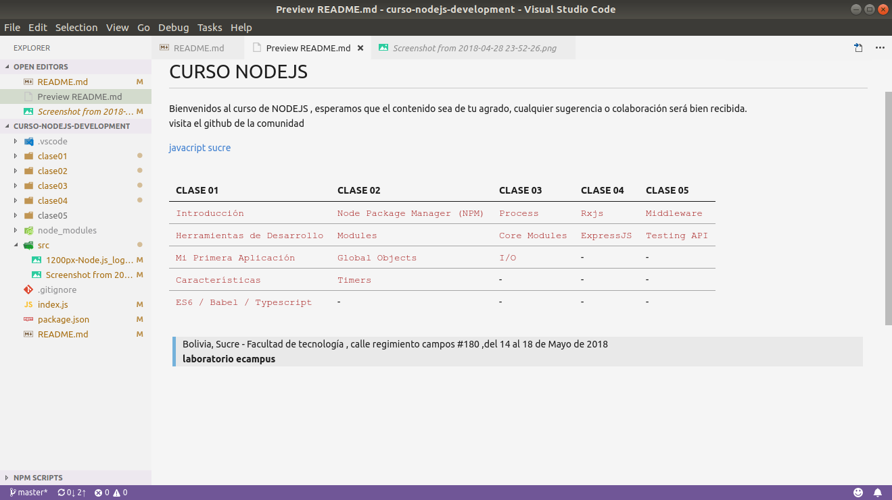

# CURSO DE NODEJS

Bienvenidos al curso de NODEJS , esperamos que el contenido sea de 
tu agrado, cualquier sugerencia o colaboración será bien recibida.
 
visita el github de la comunidad

[javacript sucre](http://www.github.com/javascript-sucre)

 

| CLASE 01 |CLASE 02 |CLASE 03 |CLASE 04 |CLASE 05 |
|:--- | :--- | :--- | :--- | :--- |
| `Introducción` | `Node Package Manager (NPM)`| `Process`| `Rxjs` | `Middleware`|
| `Herramientas de Desarrollo` | `Modules` | `Core Modules`| `ExpressJS` | `Testing API`|
| `Mi Primera Aplicación` | `Global Objects`| `I/O` | - | - | - |
| `Características` | `Timers` | - | -  | - |
| `ES6 / Babel / Typescript` | - | -  | - | - | -  |

 

> Bolivia, Sucre - Facultad de tecnología , calle regimiento campos #180 ,del 14 al 18 de Mayo de 2018 , <b>laboratorio ecampus</b>

[descargar diapositiva](http://www.github.com/javascript-sucre)

 

## VISTA PREVIA

